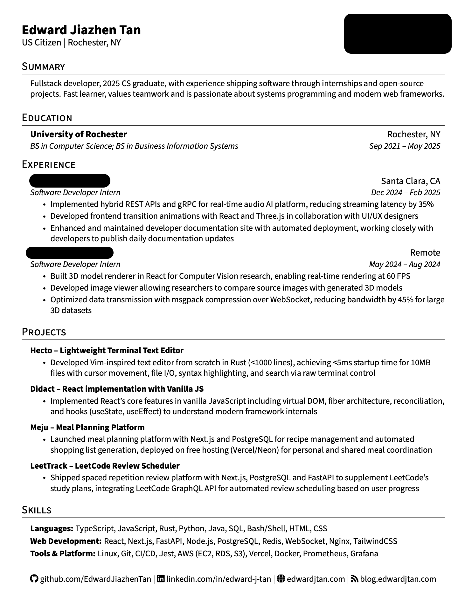

# Resume Generator

A Python-based resume generation system using YAML data and LaTeX templates.

## Demo



## Setup

1. **Clone and navigate**
   ```bash
   git clone <repository-url>
   cd Resume
   ```

2. **Install LaTeX**
   - macOS: `brew install --cask mactex`
   - Ubuntu: `sudo apt-get install texlive-full`
   - Windows: Install MiKTeX or TeX Live

3. **Setup Python environment**
   ```bash
   python3 -m venv venv
   source venv/bin/activate  # On Windows: venv\Scripts\activate
   ```

4. **Install Python dependencies**
   ```bash
   pip install -r requirements.txt
   ```

5. **Generate resume**
   ```bash
   python3 generate_resume.py
   ```

## Usage

### One-time Generation

**Basic usage** (uses default settings):
```bash
python3 generate_resume.py
```
Generates PDF from `src/example.yaml` → outputs to `resume/Resume.pdf`

**Advanced options**:
```bash
python3 generate_resume.py [OPTIONS]
```

| Parameter | Short | Default | Description |
|-----------|-------|---------|-------------|
| `--data` | `-d` | `src/example.yaml` | YAML file with your resume data |
| `--template` | `-t` | `src/example.tex` | LaTeX template file |
| `--output` | `-o` | `build/resume.tex` | Where to save generated .tex file |
| `--pdf-name` | | `Resume` | Name for output PDF (without .pdf extension) |
| `--backup-dir` | | `resume/backups` | Directory for timestamped backups |
| `--no-pdf` | | | Generate .tex only, skip PDF compilation |
| `--no-backup` | | | Skip creating timestamped backup |

**Example commands**:
```bash
# Use a different YAML file for a specialized resume
python3 generate_resume.py --data src/backend.yaml --pdf-name Backend_Resume

# Generate LaTeX only, no PDF
python3 generate_resume.py --no-pdf

# Custom output name without backup
python3 generate_resume.py --pdf-name John_Doe_2024 --no-backup
```

### Live Development Mode
Watch for file changes and auto-regenerate:
```bash
python3 watch_resume.py
```
Edit `src/example.yaml` and save - your PDF will automatically regenerate!

## Customization

**Edit content**: Modify `src/example.yaml` with your information

**Personalize output**:
- Change PDF filename: `python3 generate_resume.py --pdf-name YourName`
- Use different data file: `python3 generate_resume.py --data src/yourfile.yaml`
- Adjust template styling in `src/example.tex`

## Project Structure

```
Resume/
├── src/                    # Source files (version controlled)
│   ├── example.yaml        # Resume data (tracked in git)
│   ├── example.tex         # LaTeX template
│   └── *.yaml             # Other resume variants (ignored)
├── build/                  # Intermediate build files (ignored)
│   ├── resume.tex         # Generated LaTeX
│   └── resume.log         # Compilation logs
├── resume/                 # Final outputs (ignored)
│   ├── Resume.pdf         # Your generated resume
│   └── backups/           # Timestamped backups
├── generate_resume.py      # Main generation script
├── watch_resume.py         # Auto-regeneration watcher
└── requirements.txt        # Python dependencies
```

